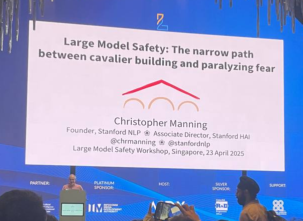
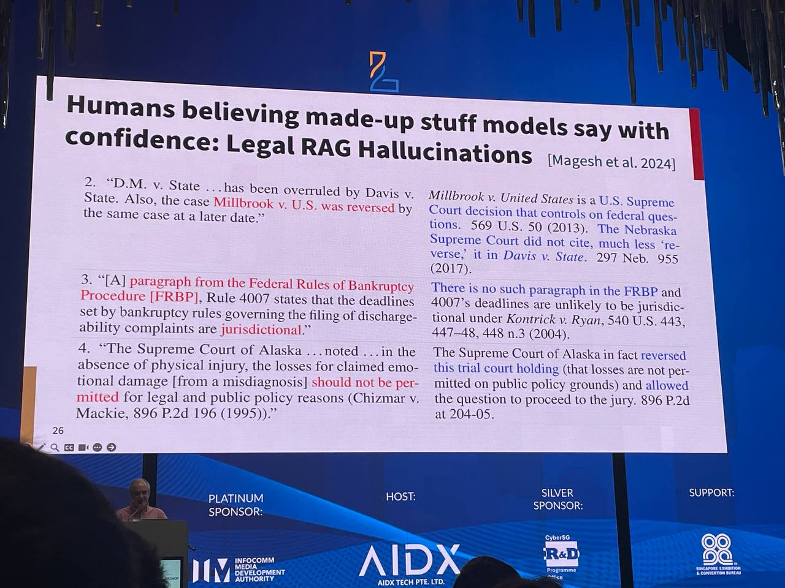
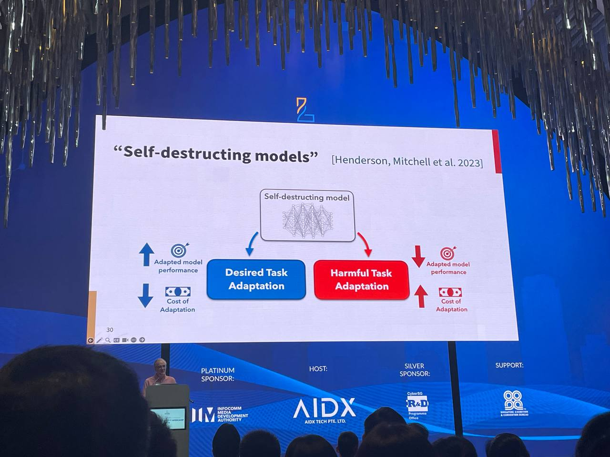

> Based on an insightful talk given by [Professor Christopher Manning from Stanford University](https://nlp.stanford.edu/~manning/) at the [LM Safety Workshop 2025](ai-safety/lmxsafety-25.md).

## The Extremes
- **Cavalier Building**: JD Vance spoke at the AI Action Summit in Paris (Feb 2025\) about how "AI is awesome" and the current U.S. government won't hinder AI innovation.
- **Paralyzing Fear**: The release of *AI 2027* warned that humanity could lose control over AI by the end of 2027, predicting autonomous AI systems outperforming humans at everything. These systems would, allegedly, lead to rapid mass robot industrialization and, ultimately, the release of a bioweapon to *eradicate* humanity.

The challenge is finding the narrow path between these two crazy extremes.

## Navigating Large Model Safety
LM Safety as a concept can be broken into 3 sectors:
- Risks that can be abetted by Large Model “direct” safety measures
- Risks that large models will cause societal instability
- “Science Fiction” / “Existential” Risks

## Risks addressed by “Direct” Safety Measures
### Basic Safety Against Harmful Requests
- Refusing to respond to harmful questions has been proven to be easy to bypass with *jailbreaks*.
- Attack Methods:
	- Static Attacks stored in existing benchmarks or test suites, e.g. [HarmBench](https://www.harmbench.org/), [AdvBench](https://paperswithcode.com/dataset/advbench) → their direct application gets patched by providers
	- Dynamic Attack Mutation or Reformulation like in [h4rm3l](https://arxiv.org/abs/2408.04811) to generate and compose attacks through mutation-like synthesis (e.g. string transformation composition, LLM-based modifications)
- Studies explore how different models respond to various types of attacks, including multi-composition jailbreaks.
- Notably, there is an exponential space of attack compositions and a huge space of novel attacks with dynamic attack generation / reformulation.
	- Multi-composition attacks need to be run on LARGE models, i.e. it does not run on 8B models as they aren’t able to handle the complexity of the attack
- **Note**: The attack surface is so vast and the contextual determinations of harm are so varied that LLMs might never be made fully “safe” in this sense → but this doesn’t matter as long as we reduce the chance of regular users seeing bad stuff
- Controlling harm correctly doesn’t involve directly trying to intervene the output of the models, it’s more so downstream

### Addressing Hallucinations & Misleading Confidence
- Humans believe made-up stuff that models say with *confidence*, leads to potential issues
	- E.g. Legal RAG Hallucinations ([Magesh et al., 2024](https://arxiv.org/abs/2405.20362))
	- Has difficulty verifying and identifying certain sections

- **Hallucinations**: Post-training with human preference data improves alignment with human behavior but neglects key aspects of useful behaviour, such as truthfulness ([Sharma & Tong, 2023](https://arxiv.org/abs/2310.13548)).
	- Paper showed that humans prefer responses that agree with them, rather than whether they are true → i.e. human data is undoubtedly biased
- **Factuality**: FactTune Reward ([Tian et al., 2023](https://arxiv.org/abs/2311.08401)) uses DPO to consistently cut hallucination rates by over 50% while increasing the general correctness of the information.

### Self-Destructing Models
- See: [Henderson, Mitchell et al., 2023](https://arxiv.org/abs/2211.14946)
- Models are easy to adapt for desired task adaptation but hard to adapt to harmful adaptation.

## Risks that Causing Societal Instability
- Prof Manning believes this is something the community should be very concerned about, but it is the *least* discussed topic
- Immediate Effect of AI Scaling and Success:
  - Incredibly improved performance in general-purpose question-answering tasks ([GPQA Diamond](https://arxiv.org/abs/2311.12022))
  - Significant drop in inference costs over the past few years
- **Economic Effects of AI Scaling and Success**:
  - Lower prices increase demand (general demand curve) → potential structural unemployment and economic shifts (it will take time for people to get jobs)
  - The AI progress means that capital pays a higher ROI than before, as AI can automate other factors of production too
  - **Piketty’s r \> g**: The rate of capital return (r) \> rate of economic growth (g) → Wealth concentrates in the hands of the rich → leads to inequality and unrest (see [Capital in the Twenty-First Century](https://en.wikipedia.org/wiki/Capital_in_the_Twenty-First_Century) by Thomas Piketty)
- **Short-Term Consequences**: Major social dislocation and unrest, leading to populist uprisings and violence.
- **Long-Term Consequences**: Next tech opportunities diffusing.

## Science Fiction & Existential Risks of AI
- Some predictions (like *AI 2027*) echo traditional sci-fi tropes, and it is a very common thought process.
- Over-exaggeration, as clearly the Humanoids race did not work out
- We tend to over- or underestimate LLM capabilities:
  - **Underestimators**: Figures like Yann LeCun downplay the capabilities of such language models.
  - **Overestimators**: Tech CEOs (e.g., Eric Schmidt, Mark Zuckerberg) often equate benchmarks to real-world impacts in society.
    - They’re deluding themselves with how much progress has taken place in AI
  - We should find a balance because LLMs on enormous data are amazing
- Claims like “AI will replace most programmers”:
  - Partly valid.
  - Amazon Q boosted coding efficiency (e.g. for upgrading Amazon’s old code from Java 8 to Java 17\) with 26% speed gains for junior devs. However, senior dev improvements remain marginal.
  - The people who push for “vibe coding” throwaway apps aren’t considering the larger picture
- **On Singularity:**
  - No imminent "singularity." Not this decade, not next decade, maybe not even ever.
  - If it happens, it'll be a gradual process over decades—perhaps never fully.

## Q\&A

| Q   | What is your opinion on the fact that AI is automating people’s jobs rather than their chores?                                                                                               |
| --- | -------------------------------------------------------------------------------------------------------------------------------------------------------------------------------------------- |
| A   | While AI may replace specialized jobs, it struggles with generalized physical intelligence. As a result, societal disruptions focus more on job displacement rather than alleviating chores. |
